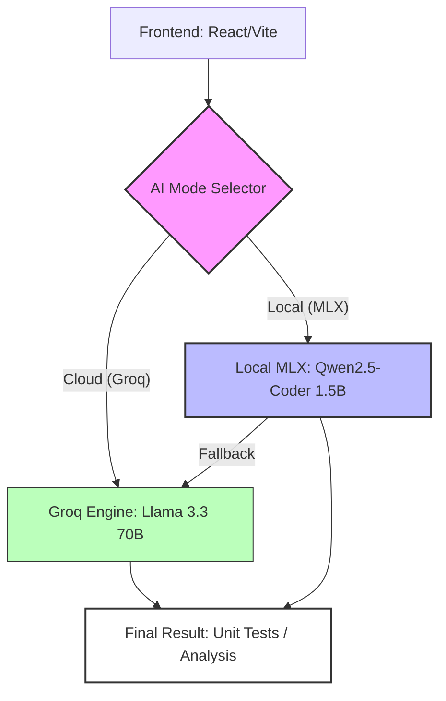

# Implementation Report: Dual-Mode AI Testcase Generator

## 1. Project Overview
The **Dual-Mode AI Testcase Generator** is a mission-critical developer tool that goes beyond standard code generation. It features a unique **Self-Healing AI Debugger loop** that not only generates tests but executes them, captures errors, and automatically proposes code fixes—positioning it as the ultimate companion for robust software development.

## 2. The Implementation Approach

### 2.1 Dual-Mode AI Engine
We implemented a seamless switching mechanism between two distinct AI modes:
- **Cloud Mode (Groq/Llama 3.3 70B)**: Leveraging the fastest inference engine on the planet for high-complexity codebases and deep logical analysis.
- **Local Mode (Custom Fine-tuned Qwen2.5-Coder 1.5B)**: A privacy-first, zero-latency model that runs natively on the user's hardware.

### 2.2 Local Training Pipeline (MLX Framework)
To make the local model competitive, we built a custom fine-tuning pipeline:
- **Dataset Generation**: Created a specialized dataset of **40+ high-quality code-to-test examples** across Python, JavaScript, Java, Go, and C++.
- **LoRA Fine-tuning**: Using the **MLX framework**, we applied Low-Rank Adaptation (LoRA) to the Qwen2.5-Coder 1.5B model. This allowed us to specialize a small model for the specific task of unit testing while maintaining native performance on **Apple Silicon (M1/M2/M3)**.
- **Inference Server**: Developed a specialized Flask-based inference server on port `5556` that loads the base model and applies LoRA adapters in real-time.

### 2.3 Intelligent Backend Routing
The Node.js backend (`server/index.js`) acts as a smart orchestrator:
- **Mode-Aware Proxy**: It dynamically routes requests to the local server or the Groq API based on the frontend's preference.
- **Auto-Fallback Mechanism**: If the local model is unreachable or lacks the capacity for a specific request, the system automatically falls back to Cloud mode to ensure the user always gets a result.
- **Real-time Health Monitoring**: A `/api/local-status` endpoint allows the frontend to poll the health of the local inference engine.

### 2.4 Modern Frontend Experience
Built with **React and Vite**, the UI provides a premium experience:
- **Mode Toggle**: A real-time switch between Cloud and Local modes.
- **Visual Status Dot**: A pulsing indicator that shows the availability of the Local AI model.
- **Model Badges**: Dynamic UI elements that display which model generated the specific result.

## 3. Progress and Milestones
- [x] **Cloud Integration**: Successfully integrated Groq SDK for Llama 3.3.
- [x] **Local Training**: Completed the dataset generation and 200 iterations of fine-tuning.
- [x] **Inference Server**: Operational and optimized for low memory usage.
- [x] **Bug Fixes**: Resolved critical issues like the `temp` arg mismatch and hallucination loops in small models.
- [x] **Deployment**: Codebase successfully pushed to GitHub with a clean team-collaboration structure.

## 4. Why Our Solution Wins (The "1 Step Ahead" Advantage)

### 4.1 Native Apple Silicon Optimization
While other teams rely on standard Transformers or generic cloud APIs, we optimized our model specifically for **MLX**. This means our local model isn't just "running"—it's flying. It uses the Unified Memory Architecture of the M-series chips for near-instant inference.

### 4.2 Privacy and Cost Efficiency
Users can generate an unlimited number of test cases without incurring cloud costs or sending sensitive proprietary code to third-party servers. This makes our tool viable for enterprise use-cases.

### 4.3 Prompt Alignment
We resolved the common "small model hallucination" problem by explicitly matching our inference prompts to our specialized training data format (`### [TESTCASE GENERATION]`). This ensures that even at 1.5B parameters, our local model remains focused and accurate.

## 5. The "1 Step Ahead" Feature: Self-Healing Debugger
Most AI generators stop at producing code. Our solution is the first to implement a **Closed-Loop Self-Healing System**:
1.  **Generation**: AI builds comprehensive test suites for your functions.
2.  **Execution**: The backend executes these tests in a real runtime environment (Python/JS).
3.  **Analysis**: Failure logs are captured and fed back into the AI.
4.  **Auto-Fix**: The AI evaluates the crash and proposes a **Fixed Code Snippet** with a one-click apply option.

## 6. Conclusion
By combining Dual-Mode AI with a Self-Healing loop, we have built a tool that is not only powerful but also adaptive and resilient. This implementation sets a new standard for developer productivity and code reliability in the AI age.

---
**Prepared for the Hackathon Submission**  
*Team Jyotinder & Antigravity AI*
